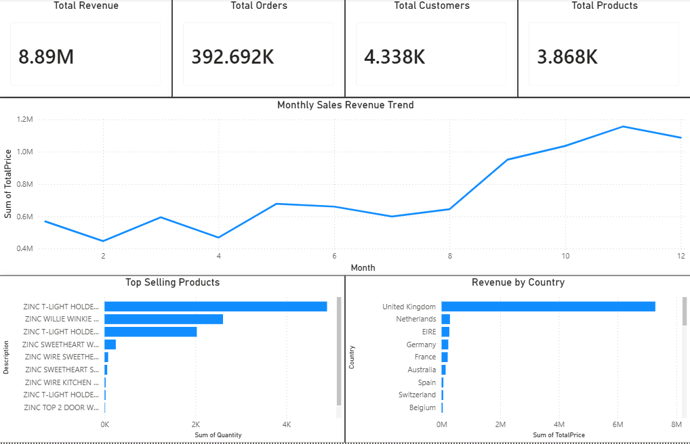

# E-Commerce Sales Analytics Dashboard

## Project Overview
This project analyzes e-commerce transaction data to uncover sales trends, customer behavior, top-selling products, and country-wise revenue insights using Python and Power BI.

## Tools & Technologies
- Python
- Pandas
- NumPy
- Matplotlib
- Seaborn
- Power BI
- Jupyter Notebook

## Key Features
- Data Cleaning & Preprocessing
- Exploratory Data Analysis (EDA)
- Monthly Revenue Trend Analysis
- Top Selling Products Analysis
- Revenue by Country
- KPI Dashboard Creation
- Interactive Power BI Dashboard

## Dashboard KPIs
- Total Revenue
- Total Orders
- Total Customers
- Total Products

## Dataset
Online Retail Dataset containing over 500,000 transaction records.

## Dashboard Preview

## Business Insights
- Identified peak sales months
- Analyzed top-performing products
- Determined highest revenue-generating countries
- Tracked monthly revenue growth trends

## Outcome
This project demonstrates practical skills in:
- Data Analysis
- Data Visualization
- Business Intelligence
- Dashboard Development
- Python for Analytics
# ecommerce-sales-analysis
Interactive E-Commerce Sales Analytics Dashboard using Python, Pandas, Matplotlib, Seaborn, and Power BI.
